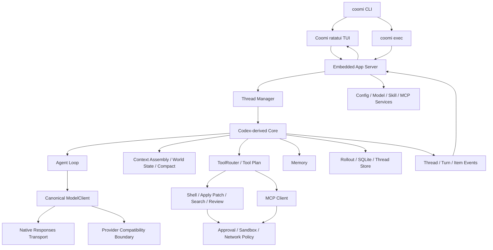
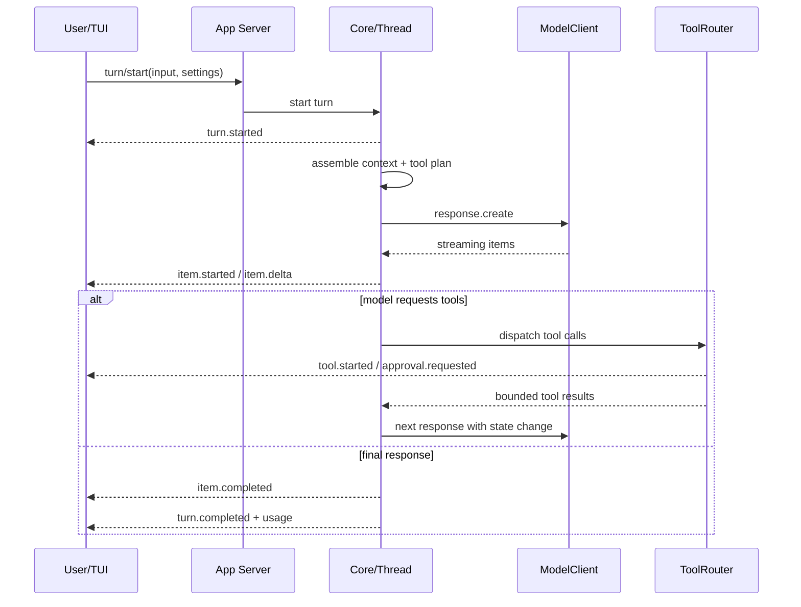

# Coomi Rust 0729 重构计划

> 状态：实施基线 v0.2（P0/P1 进行中）
>
> 编制日期：2026-07-29
>
> 目标分支：`coomi-rs-0729`
>
> 目标形态：基于 OpenAI Codex `codex-rs` 的 Rust 原生终端 AI 编程助手
>
> 上游基线：`openai/codex@9a6668f674d74b35418fa534b3b6285a315d0765`
>
> 基线提交时间：2026-07-29T12:13:14Z

## 1. 文档目的

本文档定义 Coomi 从 Python/Textual 架构完整重构为 Rust/Tokio/ratatui 架构的实施方案、范围边界、成本治理目标、阶段计划和验收标准。

本次重构不是把当前 Python 实现逐模块翻译为 Rust，也不是重新发明一套智能体框架。核心策略是以 Codex Rust 架构为唯一技术真源，采用 **fork-and-prune（继承后裁剪）**：

1. 继承 Codex 已验证的智能体循环、事件协议、上下文管理、工具路由、会话存储、权限审批和沙箱机制。
2. 删除 Coomi 首版不需要的云端、多智能体、桌面端、语音、Apps/connectors 等产品面。
3. 在不破坏核心边界的前提下，融入 Coomi 的流程透明、成本可视化、Memory/Skill/MCP 管理中心和品牌化 TUI。
4. 最终产品安装、运行和测试关键路径不依赖 Python 运行时。

实施已于 2026-07-29 在 `coomi-rs-0729` 分支启动。固定上游快照、来源记录、Rust 工具链和首批 Coomi-owned crate 的实际状态见同目录的《实施状态》和 `adr/`；本文仍是范围、阶段和验收标准的主基线。

### 1.1 当前实施状态（2026-07-30）

- 已固定并导入 `openai/codex@9a6668f674d74b35418fa534b3b6285a315d0765` 的 `codex-rs/`，5,394 个文件逐路径 SHA-256 差异为 0；
- 已将纯上游快照独立提交为 `3e788b384c2c796c5288672d5c49a04fa47de45c`；
- 已安装并验证 Rust 1.95.0、rustfmt、Clippy 和 Windows MSVC x64 工具链；
- 已建立 `coomi-cli` 与 `coomi-provider-adapters`，通过 `cargo check`、5 个单元测试和严格 Clippy；
- `coomi` 已直接链接 Codex TUI/exec crate，并使用独立 `~/.coomi` 配置根；
- `coomi --version`、`--help`、`exec --help` 和 `resume --help` 已通过本地 binary 验证，帮助页无 Codex 品牌残留；
- P0 动态成本基线、provider C01-C10 探测和 P1 mock Responses Turn 尚未完成，不计为已验收。

## 2. 执行摘要

### 2.1 核心结论

参考 Codex 重构能够解决当前 Coomi 的大部分成本和无效工具调用问题，但节省 token 的原因不是“换成 Rust”本身，而是继承并正确约束以下机制：

- 稳定、可缓存的提示词前缀；
- 按世界状态变化增量组装上下文；
- Responses API 的请求连续性与 prompt cache；
- 按任务暴露工具，而不是每轮发送全部工具 schema；
- 按 token 预算裁剪工具结果；
- 基于模型上下文能力的自动 compact；
- 对重复、无进展和低信息工具回合的确定性终止；
- Memory 和 Skill 的渐进式加载；
- 对每次模型请求、工具调用和 compact 的完整成本观测。

Rust/Tokio 主要解决本地启动速度、并发、内存占用、工具调度延迟和跨平台可靠性；上下文和调用策略才直接决定模型费用。若只是把 Python 代码机械翻译成 Rust，而继续全量发送提示词、工具和历史，模型成本不会实质下降。

### 2.2 已确定的默认决策

| 主题 | 决策 |
| --- | --- |
| 架构真源 | 以固定 Codex 提交为唯一基线，当前 Python Coomi 仅用于 UI、数据迁移和行为验收 |
| 实施方法 | fork-and-prune，不重写已有成熟 Agent Loop、上下文、工具和沙箱内核 |
| 异步运行时 | Rust 2024 Edition + Tokio |
| TUI | 继承 Codex ratatui 基础设施，按 Coomi 现有交互全面重构 |
| 模型 wire API | Codex Core 保持 Responses-only；第三方差异由独立 provider adapter 在边界转换 |
| 工具协议 | 完整继承 Codex `ToolSpec`、`ResponseItem`、流式 tool delta、ToolRouter 和 tool output 语义 |
| 上下文 | 采用 Codex 上下文组装、world state、prompt cache 和 compact 设计 |
| Memory | Codex Memory 作为唯一记忆引擎，迁移旧 Coomi Memory 数据 |
| Skill | Codex Skill discovery/渐进加载为底座，增加 Coomi 管理中心 |
| MCP | 保留 stdio、Streamable HTTP、OAuth、tools/resources/elicitation |
| 沙箱 | 延续 Codex 权限、审批、网络策略及 Windows/Linux/macOS 沙箱抽象 |
| 多智能体 | 首版删除运行能力，保留协议和扩展边界，不向模型暴露相关上下文和工具 |
| 品牌 | 用户可见内容全部为 Coomi；内部 `codex-*` crate 首期允许保留原名 |
| Python | 最终发布关键路径零 Python；旧实现仅在迁移阶段保留为只读参考 |

## 3. 背景与现状问题

### 3.1 当前 Python Coomi 架构

当前实现主要由以下部分组成：

- `coomi/engine`：智能体循环、重试、会话、工具执行、后台任务；
- `coomi/services/context`：压缩、缓存和消息修复；
- `coomi/services/llm`：OpenAI、Anthropic、DeepSeek、Generic provider；
- `coomi/services/memory`：抽取、召回和管理；
- `coomi/services/skills`：Skill 安装、启停和 prompt 注入；
- `coomi/services/mcp`：MCP 客户端、配置和工具适配；
- `coomi/security`：权限、hooks 和 shell 安全；
- `coomi/ui`：Textual TUI、命令、状态面板、管理页面。

这些能力覆盖面已经较完整，但核心逻辑在 UI、provider、上下文和工具注册之间耦合较多，缺少统一事件协议、精细 token 预算和稳定的工具暴露计划。

### 3.2 成本问题静态基线

以下数据来自 2026-07-29 对当前仓库的静态核算，实施阶段必须用真实 tokenizer 和 API usage 再建立动态基线：

| 项目 | 当前值 | 直接影响 |
| --- | ---: | --- |
| 简单 System Prompt | 约 6,903 字符 | 每轮固定输入偏大 |
| 15 个默认工具 schema | 约 9,632 字符 | 即使不用工具也可能支付 schema 成本 |
| 历史消息前固定输入 | 约 16,535 字符 | 粗估约 4k-5.5k tokens，尚未包含会话历史 |
| 大工具结果落盘阈值 | 50 KiB | 大量无关输出在进入上下文后才被处理 |
| 单个激活 Skill 注入上限 | 12,000 字符 | 多 Skill 场景会快速膨胀上下文 |
| 自动 compact 阈值 | 上下文窗口 90% | 触发过晚，接近窗口上限才治理 |
| 最大循环次数 | 100 | 异常任务可产生大量连续请求 |
| 低信息停止阈值 | 连续 8 次 | 无效调用被终止得过晚 |

对应源码基线包括：

- `coomi/engine/session.py`：大段静态 System Prompt 及动态 Memory/Skill/MCP 注入；
- `coomi/engine/loop.py`：每轮获取默认工具定义，`MAX_ITERATIONS = 100`，连续 8 次低信息结果才停止；
- `coomi/engine/tool_executor.py`：`LARGE_RESULT_THRESHOLD = 50 * 1024`；
- `coomi/services/context/compressor.py`：`COMPRESS_THRESHOLD = 0.9`；
- `coomi/services/skills/manager.py`：激活 Skill 最多注入 12,000 字符；
- `coomi/services/llm/openai.py`：把完整消息历史转换为 stateless Responses input，未使用 `prompt_cache_key` 或 `previous_response_id`。

### 3.3 无效调用的主要成因

1. 工具默认全量暴露，增加模型选择噪声和误调用概率。
2. 文本工具调用 fallback 需要模型学习额外格式，并产生格式纠错回合。
3. 工具结果按字节而非 token 治理，中文、代码和结构化数据的成本不可预测。
4. 重复调用主要依赖循环后期检测，缺少“世界状态是否变化”的前置判断。
5. 记忆召回可能调用辅助模型，低信号输入也可能产生额外成本。
6. compact 触发太晚，压缩前已经支付多轮高输入成本。
7. provider 能力差异在运行时被 fallback 吸收，使错误恢复和无效请求难以审计。

### 3.4 工程问题

- Python/Textual 启动、并发和子进程生命周期管理不够稳定；
- UI 直接持有较多 engine/service 对象，边界不清晰；
- 会话状态、TUI 状态和工具状态存在多份表示；
- provider 越多，兼容逻辑和文本 fallback 的测试组合越大；
- Windows、Linux shell 和权限行为缺少统一底层抽象；
- 缺少统一的 token、缓存命中、工具失败、重复调用和 compact 观测模型。

## 4. 重构目标与非目标

### 4.1 产品目标

1. 达到 Codex CLI 级别的流式交互、取消、steering、恢复、分叉、审批和终端稳定性。
2. 保留 Coomi 的过程透明度，并让工具、计划、权限、上下文和成本状态更易扫描。
3. 提供统一的 Skill、MCP、Memory、模型和权限管理中心。
4. 支持 Windows 和 Linux 正式发布，macOS 保持可编译并通过沙箱相关测试。
5. 保持 `coomi` 作为唯一用户入口和产品品牌。

### 4.2 架构目标

1. 采用 Thread/Turn/Item 事件模型，TUI 只消费协议事件和发出命令。
2. 采用 embedded App Server 边界，使 TUI 与 Core 解耦，同时避免首版远程 daemon 复杂度。
3. 直接继承 Codex Agent Loop、ModelClient、ToolRouter、rollout/state 和 sandbox 抽象。
4. 所有模型可见内容均有明确 token 预算和来源标识。
5. 未启用的功能不注册工具、不注入说明、不占用上下文。
6. 用户可见的状态变化可由事件日志复现，关键决策可审计。

### 4.3 成本目标

1. 相同模型、仓库和任务集下，首版基准任务的 P50 计费输入 token 相比 Python Coomi 至少降低 35%。
2. 简单问答/澄清类无工具任务的 P50 计费输入 token 至少降低 50%。
3. 相比固定上游 Codex 基线，Coomi 定制功能造成的总输入 token 增幅不得超过 10%。
4. 稳定前缀支持缓存的 provider 上，第二轮起稳定前缀缓存命中率目标不低于 80%。
5. 未选择或未搜索到 MCP 工具时，MCP 工具 schema 的模型可见成本为 0。
6. 低信号输入不触发 Memory 辅助模型调用。
7. 同一参数、同一世界状态下的重复工具调用率不高于 2%，并具备确定性拦截。

以上是发布门槛目标，不以降低回答质量、减少必要验证或截断关键证据为代价。

### 4.4 非目标

- 不对当前 Python 模块做逐行 Rust 翻译；
- 不在首版支持 Codex 的全部产品功能；
- 不在首版实现多智能体调度、Agent Graph 或子智能体 UI；
- 不在首版支持 Codex Cloud、IDE、桌面 App 或浏览器产品面；
- 不让 Anthropic Messages 或 Chat Completions 的消息/tool schema 渗透 Codex Core；
- 不支持 XML、DSML、正则提取或自然语言伪工具调用；
- 不在首版进行所有内部 `codex-*` crate 的机械重命名；
- 不把“更好看”理解为装饰性堆叠，TUI 优先信息密度、状态清晰和长时间使用舒适度。

## 5. 架构原则

### 5.1 Codex 优先

当 Coomi 现有实现和 Codex 设计冲突时，默认采用 Codex 的数据模型、生命周期和失败语义。只有以下情况允许偏离：

- Coomi 明确的产品差异，如管理中心、品牌和成本可视化；
- 已通过 benchmark 证明 Codex 默认行为不满足 Coomi 成本目标；
- 平台兼容或许可证要求；
- 已形成 ADR，并有回归测试覆盖。

### 5.2 继承后裁剪

- 保留上游代码历史和提交来源，先跑通再裁剪；
- 裁剪以 feature、crate 和协议能力为单位，不在核心循环中散布品牌条件分支；
- 删除功能时同时删除对应 prompt、工具 schema、配置项、事件和依赖；
- 对上游核心的修改集中在少数 Coomi-owned adapter/extension 层；
- 每次同步上游时先重放 Codex 测试，再运行 Coomi 差异测试。

### 5.3 单一状态真源

- Thread 状态由 Core/Thread Store 持有；
- Turn 生命周期由 Agent Loop 持有；
- Item 是 TUI 渲染和 rollout 持久化的最小事件单元；
- 权限、工具执行、token usage 和 compact 都通过协议事件公布；
- TUI 不直接修改会话内部结构，也不自己推断工具是否完成。

### 5.4 零隐式上下文成本

- 禁用功能不得向模型发送说明；
- Skill 先发送元数据，仅在明确触发后加载完整正文；
- MCP 先发送服务器/工具索引，具体 schema 按需发现；
- Memory 先做本地相关性判断，满足阈值后才进入 prompt 或调用辅助模型；
- 世界状态不变时不重复注入等价上下文片段。

### 5.5 可观测后优化

所有成本优化必须通过同一套事件和 benchmark 验证。禁止只依据字符数或单次人工体验宣称成本下降。

## 6. 目标架构



### 6.1 分层职责

| 层 | 主要职责 | 禁止承担 |
| --- | --- | --- |
| CLI | 参数解析、入口选择、非交互命令 | Agent Loop、上下文拼装 |
| TUI | 渲染、输入、导航、审批交互 | 直接执行工具、修改 Thread 内部状态 |
| Embedded App Server | 协议适配、请求路由、事件订阅、配置服务 | 复制 Core 业务逻辑 |
| Core | Thread/Turn、Agent Loop、上下文、模型会话、工具编排 | 品牌化 UI 规则 |
| Tool Runtime | 工具 schema、路由、并发、生命周期、输出治理 | 自行绕过权限策略 |
| Policy/Sandbox | 审批、文件系统、进程、网络和平台隔离 | 模型推理 |
| Persistence | rollout、SQLite、恢复、分叉、索引 | TUI 专有状态 |
| Extension | Skill、MCP、Memory、Web Search、Review | 修改核心协议的不兼容捷径 |

### 6.2 Embedded App Server 决策

首版保留 Codex App Server 的协议和服务边界，但仅使用进程内 transport：

- TUI 与 Core 通过类型化请求/通知交互；
- 测试可用 mock client 重放完整会话；
- 日后可增加 daemon、IDE 或远程控制，而不需要重写 Core；
- 首版不开放公网监听，不交付 WebSocket daemon，不承担远程鉴权成本。

## 7. 功能范围矩阵

### 7.1 首版必须保留

| 能力 | 范围 | 采用方式 |
| --- | --- | --- |
| Thread/Turn/Item | start/resume/fork/interrupt/steer/rollback | 继承 Codex 协议和状态机 |
| Agent Loop | 流式响应、连续工具回合、重试、取消、结束判定 | 继承 Core，不从 Python 移植 |
| 上下文组装 | 稳定前缀、world state、AGENTS.md、能力片段 | 继承并增加预算台账 |
| Compact | 自动/手动、摘要、工具结果清理、预算保留 | 继承 Codex compact 流程 |
| Memory | 写入、读取、重置、项目/用户作用域 | 使用 Codex Memory，导入旧数据 |
| 模型管理 | catalog、能力、reasoning effort、会话内切换 | 继承 models manager |
| 模型 transport | 原生 Responses、SSE/可选 WebSocket、受控 Chat tool adapter | Core 保持 Codex canonical protocol |
| 核心工具 | shell、unified exec、apply patch、文件搜索、计划、用户询问 | 继承 ToolRouter 与 runtime |
| 工具并发 | 只读且独立任务并发，写操作受控串行 | 使用 Codex 并发语义 |
| 会话持久化 | rollout、SQLite、恢复、分叉、历史列表 | 继承 state/rollout/thread-store |
| Skill | discovery、渐进加载、启停、安装、刷新 | 继承 Skills + Coomi 管理层 |
| MCP | stdio/HTTP/OAuth/tools/resources/elicitation | 继承 rmcp client 与 core MCP |
| 权限审批 | profile、单次/会话批准、命令前缀、网络审批 | 继承协议和策略 |
| 沙箱 | workspace-write、read-only、danger-full-access | 继承跨平台抽象和平台实现 |
| Git | repo 状态、diff、review 基础能力 | 继承 git-utils/review |
| TUI | 流式对话、工具时间线、管理中心、模型/权限/上下文状态 | 基于 Codex ratatui 重构 |
| 非交互模式 | `coomi exec`、结构化输出、退出码 | 精简继承 Codex exec |

### 7.2 首版保留但精简

| 能力 | 首版范围 | 裁剪内容 |
| --- | --- | --- |
| Plugin | 仅保留打包 Skill + MCP 的最小基础设施 | 隐藏 Apps/connectors 和市场治理 |
| Web Search | 保留模型支持的 Web Search 和必要事件 | 不构建浏览器产品面 |
| Review | 保留 `/review`、diff review 和结果呈现 | 不接云端 PR 自动化 |
| Hooks | 保留本地工具生命周期策略接口 | 不做企业级分发和远程管理 |
| 登录/认证 | OpenAI 登录/API key 和兼容 provider 凭据 | 不接企业云任务身份体系 |

### 7.3 第二阶段候选

- 图片输入和本地图片查看；
- 更完整的 Plugin 市场和签名校验；
- 远程 App Server/IDE 接入；
- 更多本地/云端 provider adapter；
- 自动化任务；
- 多智能体和协作模式；
- 可选的遥测导出。

### 7.4 明确删除

- Codex Cloud tasks、cloud environment、cloud task client；
- ChatGPT desktop/IDE/browser/Chrome 产品面；
- Apps/connectors；
- Voice、Audio、Realtime conversation；
- 首版多 Agent、Agent Graph、collaboration mode；
- Guardian 和完整 Codex Security 产品；
- AWS Bedrock、企业治理、远程 analytics；
- V8/code mode、Sites、Image Generation；
- App Server daemon 和远程 WebSocket transport；
- Coomi/Codex 作为 MCP Server；
- Python XML/DSML/文本工具调用 fallback；
- Anthropic Messages wire adapter 和当前无能力声明的 Generic provider；
- 任何 XML/DSML/自然语言文本工具 fallback。

删除能力必须从 Cargo features、配置 schema、CLI、TUI、事件、工具注册和 prompt 片段中同时移除，避免“界面隐藏但仍有上下文成本”。

## 8. Rust Workspace 与 crate 规划

### 8.1 目录策略

实施初期保留上游 `codex-rs/` 目录和主要 `codex-*` package 名称，以减少路径改动和后续上游同步冲突。用户入口、二进制名、配置目录、文档、TUI 文案和 release artifact 全部使用 Coomi 品牌。

最终建议布局：

```text
Coomi/
├── codex-rs/                   # 固定上游基线派生的 Rust workspace
│   ├── core/
│   ├── protocol/
│   ├── app-server/
│   ├── app-server-protocol/
│   ├── tui/
│   ├── cli/
│   ├── exec/
│   ├── tools/
│   ├── skills/
│   ├── memories/
│   ├── rmcp-client/
│   ├── rollout/
│   ├── state/
│   ├── sandboxing/
│   └── ...保留的基础 crate
├── coomi-rs/                   # Coomi-owned adapter/feature crates，可在 P1 确认后命名
│   ├── coomi-brand/
│   ├── coomi-provider-adapters/
│   ├── coomi-migration/
│   └── coomi-cost-evals/
├── docs/
└── LICENSES/
```

如果实践证明额外的 `coomi-rs/` workspace 会增加 Cargo 管理成本，可将 Coomi-owned crate 直接作为 `codex-rs/` workspace member。该选择在 P0 ADR-003 固化，不能在中期反复移动目录。

### 8.2 逻辑组件映射

| 逻辑组件 | 上游来源 | Coomi 改动原则 |
| --- | --- | --- |
| Core | `codex-core`, `core-api`, `protocol` | 尽量原样，差异通过 config/extension 注入 |
| App Server | `app-server`, `app-server-protocol` | 保留 in-process，裁掉 daemon/远程能力 |
| Model | `codex-api`, `model-provider`, `models-manager` | Core 保持 Responses；Coomi adapter 只在 wire 边界转换 |
| Context | `core/src/context`, `context-fragments` | 增加 token ledger 和 Coomi feature fragments |
| Tool | `core/src/tools`, `tools`, `exec`, `apply-patch` | 增加工具暴露预算和重复调用闸门 |
| State | `rollout`, `state`, `thread-store` | 保留数据模型，修改产品路径和迁移入口 |
| Skill | `skills`, `core-skills`, `ext/skills` | 增加安装/启停/更新管理 UI |
| Memory | `memories/read`, `memories/write`, `ext/memories` | 作为唯一引擎，增加旧数据导入 |
| MCP | `rmcp-client`, `codex-mcp`, `ext/mcp` | 保留 client，删除 server 产品面 |
| Sandbox | `sandboxing`, `execpolicy`, `linux-sandbox`, `windows-sandbox-rs` | 保持上游语义，做跨平台发布测试 |
| TUI | `tui`, `terminal-detection`, `ansi-escape` | 复用 runtime，重做 Coomi view/model/style |
| CLI | `cli`, `exec` | 二进制和帮助文案全部品牌化 |

### 8.3 内部命名策略

- P0-P6 不进行全量 `codex-*` 到 `coomi-*` 的 crate rename；
- 新增的 Coomi 专有 crate 使用 `coomi-*`；
- 用户可见 telemetry/event 字段不得泄露不必要的 Codex 品牌；
- 上游来源字段保留 commit 和 crate provenance；
- 稳定发布后另行评估是否重命名内部 crate，重命名不与功能开发混在同一阶段。

## 9. Agent Loop 与事件模型

### 9.1 生命周期



### 9.2 必须继承的行为

- 单 Thread 串行 Turn，一次只允许一个 active turn；
- 同一 Turn 内可有多个模型/工具回合；
- 流式 item 的 started/delta/completed 顺序可验证；
- interrupt 立即停止后续工具调度并收敛子进程；
- steer 将新用户输入送入当前 Turn 的合法边界，而不是破坏历史；
- retry 使用有限预算、指数退避和明确的可重试错误分类；
- tool call 与 tool result 严格关联，恢复时不得出现孤立结果；
- 所有终止原因进入事件和 rollout：完成、取消、预算、策略拒绝、错误、无进展。

### 9.3 进展不变量

每个后续模型请求至少满足一个条件：

1. 新增用户输入；
2. 新增工具结果；
3. 权限/网络/环境状态发生变化；
4. 执行 compact 并产生新摘要；
5. 恢复自可重试传输错误且尚未耗尽 retry budget。

若以上条件均不成立，则禁止发起下一次模型请求。

### 9.4 循环预算

不沿用固定 `MAX_ITERATIONS=100`。采用多维预算：

- 模型请求预算；
- 工具调用总预算；
- 单工具重复预算；
- 连续失败预算；
- wall-clock 预算；
- 输入/output token 预算；
- 用户可中途扩展的预算。

默认值在 P3 benchmark 后确定。任何预算耗尽都必须返回可恢复状态和具体原因，不能伪装成正常完成。

## 10. 上下文组装与 Prompt Cache

### 10.1 上下文分层

模型输入按以下稳定顺序组装：

1. **Stable Base**：模型基础指令、核心行为和输出约束；
2. **Stable Capabilities**：本 Turn 实际启用的核心工具 schema，顺序确定；
3. **Repository Instructions**：`AGENTS.md` 层级规则和项目配置；
4. **World State**：cwd、sandbox、permission、model、环境等，仅在变化时更新；
5. **Extension Metadata**：可用 Skill/MCP 的紧凑索引；
6. **Activated Content**：本任务触发的 Skill 正文、Memory 片段、MCP schema；
7. **Conversation State**：未压缩的近期 Thread items 与 compact 摘要；
8. **Current Input**：用户本轮输入及必要附件。

### 10.2 稳定前缀规则

- 内容和序列化必须确定性排序；
- 不把时间戳、随机 ID、动态 token 计数放入稳定前缀；
- 功能状态变化通过 world state item 表达，不重写完整基础指令；
- 工具 schema 的字段顺序稳定，描述保持短而精确；
- 模型切换、权限切换和 Skill 激活会明确使相关 cache segment 失效；
- 每次请求记录 stable prefix hash，便于分析缓存失效原因。

### 10.3 Responses 连续性

优先继承 Codex `ModelClientSession`：

- 会话级 `prompt_cache_key`；
- 支持时使用 `previous_response_id` 维持同一 Turn 的请求连续性；
- SSE 为基础 transport，可选继承 Responses WebSocket 及 prewarm；
- 传输 fallback 不改变 Thread/Turn/Item 语义；
- provider 不报告 cached tokens 时，仍记录前缀 hash 和发送字节，但不伪造缓存收益。

对经过 Chat Completions adapter 的 provider，`previous_response_id` 和 Responses 原生 item continuity 不存在。adapter 必须显式标记 `stateless_replay = true`，由 Coomi 重发受预算约束的 canonical history；不得伪造 Responses response ID，也不得把厂商自己的上下文缓存等同于 OpenAI `prompt_cache_key`。因此，这类 provider 可以兼容核心工具循环，但通常无法获得与原生 Responses 完全相同的上下文成本和恢复语义。

必须区分两个指标：

- **传输输入量**：客户端实际发送给 provider 的输入；
- **计费未缓存输入量**：provider usage 中未命中缓存的 input tokens。

仅减少传输字节不一定降低计费，反之亦然，二者分别观测。

### 10.4 上下文片段预算

每类片段必须实现 `TokenBudget`，不得只用字符数：

| 片段 | 首版策略 |
| --- | --- |
| Base instructions | 固定上限，变更需 snapshot 和成本评审 |
| AGENTS.md | 按作用域选择，超限时保留最近层级并给出可见警告 |
| Tool schemas | 根据 Tool Spec Plan 选择，不全量注入 |
| Skill metadata | 全量仅含 name/description/path/trigger 摘要 |
| Skill body | 仅触发后加载，按任务预算截取并支持继续读取引用 |
| MCP schemas | `tool_search`/显式选择后才加载 |
| Memory | 相关性过滤、去重、按用户/项目作用域预算 |
| Tool results | 按工具类型和 token 预算裁剪，完整内容保存在 artifact |
| Recent history | 与 compact 摘要共享总预算，优先保留未完成状态 |

## 11. Compact 与 Memory

### 11.1 Compact 策略

删除“窗口使用 90% 才处理”的固定规则，改为模型能力驱动：

```text
usable_budget = model_context_window
              - reserved_output_tokens
              - safety_margin
              - next_tool_round_reserve

compact_trigger = min(model_auto_compact_limit, usable_budget)
```

Compact 分三层执行：

1. **零模型 micro-compact**：移除可重建的旧工具 schema、截断过期工具结果、合并重复 world state；
2. **结构化历史裁剪**：保持 assistant tool call 与 tool result 原子组，保留未完成计划、修改文件和验证状态；
3. **模型摘要**：仅在前两层不足时调用，输出结构化 compact item。

摘要必须保留：

- 用户目标、约束和最新优先级；
- 已完成工作及证据；
- 当前修改文件和关键符号；
- 工具失败、审批和未解决风险；
- 测试结果；
- 下一步行动；
- 不可丢失的用户偏好或项目决策。

### 11.2 手动 compact

`/compact` 生成正式 Thread item，并展示 compact 前后 token、被移除项目数和摘要状态。失败时保留原历史，不允许破坏会话。

### 11.3 Memory 策略

Codex Memory 成为唯一记忆引擎，当前 Coomi 的 `MemoryManager/Recall/Extractor` 不移植。首版支持：

- 用户级和项目级作用域；
- 显式添加、查看、删除、搜索和重置；
- 会话结束或稳定事实形成后的受控写入；
- 本地候选检索和去重；
- 相关 Memory 作为有来源、有预算的上下文片段；
- 旧 Coomi Memory 一次性导入，原文件不修改。

### 11.4 Memory 成本闸门

以下输入默认不调用辅助 Memory 模型：

- 问候、确认、取消、继续、状态查询；
- 短命令和纯 UI 导航；
- 当前 Turn 已含完整答案的局部追问；
- 本地索引无候选；
- Memory 被用户关闭。

Memory 辅助调用必须单独记录 input/output tokens，不能混入主模型成本。

## 12. 工具体系与无效调用治理

### 12.1 ToolRouter

直接继承 Codex ToolRouter、registry、handler、runtime 和 lifecycle 结构。所有工具调用统一经过：

```text
schema exposure -> argument validation -> policy check -> approval
-> sandbox selection -> execution -> output normalization
-> token truncation -> event + rollout
```

任何 Coomi 专有工具不得绕过该路径。

### 12.2 Codex canonical tool protocol

Coomi 内部工具协议直接继承固定 Codex 基线，不为任何模型厂商创建第二套工具对象。canonical protocol 包括四层：

1. **Tool definition**：`codex_tools::ToolSpec`；
2. **Model item**：`codex_protocol::models::ResponseItem`；
3. **Streaming event**：`codex_api::ResponseEvent`；
4. **Execution boundary**：`ToolRouter`、`ToolPayload`、`ToolOutput` 和 lifecycle events。

首版需要保留的 `ToolSpec` 变体：

| Codex 类型 | 语义 | 首版处理 |
| --- | --- | --- |
| `Function` | JSON Schema function tool | 所有 provider 必须支持的最小公分母 |
| `Namespace` | 有命名空间的工具集合 | provider 支持时原样发送，否则确定性扁平化 |
| `ToolSearch` | 延迟工具发现 | provider 支持时原样发送，否则降级为同名 function tool |
| `WebSearch` | provider 托管 Web Search | 不支持时替换为 Coomi 本地/扩展 function tool |
| `Freeform` | 自定义语法的自由格式工具 | 不支持时包装为带单个字符串参数的 function tool |

canonical tool call 和结果至少保留：

- `FunctionCall { name, namespace, arguments, call_id }`；
- `FunctionCallOutput { call_id, output }`；
- `CustomToolCall/CustomToolCallOutput`；
- `ToolSearchCall/ToolSearchOutput`；
- 流式 `ToolCallInputDelta { item_id, call_id, delta }`；
- tool item 的 started/delta/completed/failed/cancelled 生命周期事件。

`arguments` 在协议层保持 JSON 字符串，与 Codex 一致；只在统一执行边界解析一次。解析失败必须形成结构化 tool protocol error，不允许从 assistant 普通文本中猜测参数。

### 12.3 协议不变量

- 每个 tool call 必须有非空、Turn 内唯一的 `call_id`；
- 每个 tool output 必须精确引用一个已存在且未完成的 `call_id`；
- 一个 call 只能产生一个 terminal output；
- 流式 arguments 按 provider 原始顺序合并，完成前不得执行；
- schema validation 在审批和执行之前完成；
- adapter 不得更改 tool name、参数含义、权限级别或幂等分类；
- tool output 进入下一模型回合前必须完成 token 裁剪和敏感信息处理；
- resume/fork 后仍能重建 call/output 关系；
- 不认识的 provider tool event 必须 fail closed，不能当作普通 assistant 文本执行。

### 12.4 Responses 与 Chat tool wire 映射

Codex Core 只理解上述 canonical protocol。provider adapter 负责 wire 格式转换：

| 语义 | Responses wire | Chat Completions tool wire | Coomi canonical |
| --- | --- | --- | --- |
| 工具定义 | `{type:"function", name, parameters}` | `{type:"function", function:{name, parameters}}` | `ToolSpec::Function` |
| 模型发起调用 | output item `function_call` | `choices[].message.tool_calls[]` | `ResponseItem::FunctionCall` |
| 流式参数 | Responses tool argument delta event | `choices[].delta.tool_calls[].function.arguments` | `ResponseEvent::ToolCallInputDelta` |
| 调用标识 | `call_id` | `tool_calls[].id` | canonical `call_id` |
| 工具结果 | input item `function_call_output` | `role:"tool" + tool_call_id` | `ResponseItem::FunctionCallOutput` |
| 并行调用 | `parallel_tool_calls` + 多 output items | 多个 `tool_calls[index]`，能力依厂商而定 | 一组独立 call items |
| 续接 | Responses item history/可选 response continuity | 重发 messages | canonical Thread history |
| 缓存 | `prompt_cache_key`/provider usage | 厂商自定义或自动 KV cache | capability 标记，不伪造等价关系 |

adapter 只能做无歧义转换。厂商字段没有 canonical 等价物时，记录 passthrough diagnostics 或舍弃非关键字段；不得把它们混入工具参数。

### 12.5 Capability reducer

每个 Turn 在 Tool Spec Plan 后运行 capability reducer：

1. 原生支持的 `Function` 直接发送；
2. `Namespace` 使用稳定、可逆的命名规则扁平化，冲突时拒绝启动 Turn；
3. `ToolSearch` 可降级为普通 function call，但仍由 Coomi 本地 registry 返回候选 schema；
4. `WebSearch` 仅在 provider 声明 hosted support 时使用托管类型，否则注册本地工具；
5. `Freeform` 可包装为 `{ input: string }` 的 native function call，不使用文本解析；
6. provider 不支持 strict schema 时，仍在客户端验证参数，但 catalog 必须显示“server strict unavailable”；
7. provider 不支持 parallel tool calls 时，向模型只允许串行调用，并由 Agent Loop 逐个推进；
8. 任何降级都会进入 Turn metadata、TUI 和成本 trace。

这里的“降级”只改变 wire 表达，不改变 ToolRouter、权限、sandbox、输出和事件语义。

### 12.6 Provider tool conformance suite

provider/model 必须通过自动探测后才能启用工具：

| 探测 | 验证内容 |
| --- | --- |
| C01 | 单个 function tool 选择、JSON 参数和 `call_id` |
| C02 | 流式 arguments 分片顺序与 UTF-8/转义边界 |
| C03 | `function_call_output`/`role:tool` 回传后能继续回答 |
| C04 | 两个并行 tool calls 及 index/call_id 关联 |
| C05 | nested object、enum、required、additionalProperties 等 schema |
| C06 | strict schema 是否由服务端真实保证 |
| C07 | tool call 与 reasoning/content 交错时的解析 |
| C08 | 中断、断流重试后不重复执行已完成 call |
| C09 | usage、cached tokens、finish reason/end-turn 映射 |
| C10 | 超长 schema、工具数量上限和错误响应 |

探测结果按 provider + base URL + model + API version 缓存并设置 TTL。厂商更新模型后必须重新探测；不能以“OpenAI-compatible”宣传语替代测试证据。

### 12.7 工具暴露计划

| 层级 | 示例 | 暴露规则 |
| --- | --- | --- |
| Always-on core | shell/unified exec、apply patch、文件搜索 | 仅在编码任务开启；简单对话可完全不发工具 |
| Contextual core | plan、ask user、review、web search | 根据模式、任务和模型能力选择 |
| Extension tools | Memory/Skill 管理动作 | 用户进入对应管理流程或明确提及时开启 |
| MCP tools | 任意 MCP server 工具 | 先索引/搜索，匹配或显式选择后加载 schema |
| Deferred features | 多 Agent、image、apps | 首版不注册、不注入 |

Tool Spec Plan 输入包括：用户意图、mode、permission profile、workspace 状态、已激活 Skill/MCP 和模型能力。计划结果进入 debug trace，但不额外调用模型。

### 12.8 工具结果预算

首版推荐初始值，P3 通过 benchmark 校准：

| 结果类型 | 模型可见预算 | 保留方式 |
| --- | ---: | --- |
| 文件列表/搜索命中 | 2,000 tokens | 按相关性，保留路径和行号 |
| 文件内容 | 4,000 tokens | 保留请求范围，提示可继续读取 |
| shell/test 输出 | 6,000 tokens | head + error region + tail |
| diff/apply patch | 6,000 tokens | 保留统计、失败 hunk 和关键变更 |
| MCP 普通结果 | 4,000 tokens | 结构化字段优先，server 可配置 |
| Web Search | 4,000 tokens | 去重结果和来源，按相关性排序 |

超限内容写入会话 artifact，模型获得摘要、截断原因、原始大小和可继续读取的句柄。不得静默丢弃错误尾部或测试失败位置。

### 12.9 重复调用拦截

工具调用指纹至少包含：

- tool name；
- canonicalized arguments；
- cwd；
- permission/sandbox profile；
- 相关文件/环境 world state version。

相同指纹只有在以下情况才允许重试：

- 上一次为可重试基础设施错误；
- 权限或网络状态已经改变；
- 输入文件或工作区状态已经改变；
- 用户明确要求重试；
- 工具声明为幂等轮询且尚未超过轮询预算。

否则返回确定性 `NoProgress` 结果，不再发起真实工具执行，并触发 Agent Loop 收敛。

### 12.10 并发规则

- 文件读取、搜索、独立状态检查可并发；
- 写文件、apply patch、依赖安装、Git 状态变更默认串行；
- MCP 工具依据 server 声明和 Coomi policy 分类；
- 并发任务共享 Turn cancellation token；
- UI 按 Item 展示每个调用，不把多个工具折叠成无法审计的单条日志。

### 12.11 移除文本工具 fallback

首版只接受 Responses 原生工具事件，或由已通过 conformance suite 的 adapter 产生的 canonical tool events。provider 不支持 native function/tool calls 时，在模型选择阶段标记不兼容，禁止退回 XML、DSML、正则提取或自然语言解析。

## 13. Skill 管理

### 13.1 运行模型

采用 Codex Skill discovery 和渐进加载：

1. 启动或文件变化时扫描 Skill 元数据；
2. 向模型提供紧凑的 available skills 索引；
3. 根据用户显式提及或触发规则选择 Skill；
4. 选中后加载完整 `SKILL.md`；
5. Skill 引用的资源按需读取，不一次性加载整个目录；
6. Skill 更新通过 watcher 热刷新，不重启 TUI。

### 13.2 Coomi Skill 管理中心

管理中心支持：

- 已安装/可发现/已禁用筛选；
- 本地路径和 Git 仓库安装；
- enable/disable/update/remove；
- 显示来源、版本、作用域、最近更新时间和验证状态；
- 查看元数据与权限需求；
- 手动触发 Skill；
- 显示本 Turn 实际加载的 Skill 及 token 占用。

### 13.3 约束

- 禁用 Skill 的 prompt 成本必须为 0；
- 默认只暴露 name + description 等元数据；
- Skill 不能直接扩大 sandbox/网络权限；
- 安装和更新属于外部状态修改，必须经过明确审批；
- Skill 内容超出预算时提供分段读取，不以字符硬截断破坏指令结构。

## 14. MCP 支持

### 14.1 首版能力

- stdio transport；
- Streamable HTTP transport；
- OAuth 流程和凭据安全存储；
- tools/list 与 tools/call；
- resources/list、resources/read；
- elicitation/request；
- server enable/disable/test/refresh；
- server 级工具 allow/deny；
- 超时、取消、健康状态和错误事件。

### 14.2 按需工具发现

连接 MCP server 不等于把其全部工具 schema 发给模型。首版流程：

1. 本地保存 server 和 tool metadata；
2. prompt 中只加入受预算约束的索引，或完全不加入；
3. 通过 `tool_search`、Skill 依赖或用户显式选择确定候选；
4. 只把候选工具 schema 加入本 Turn；
5. Turn 结束后默认释放临时暴露，除非会话明确固定。

### 14.3 Coomi MCP 管理中心

展示 server 状态、transport、认证、工具数、延迟、最近错误、作用域和权限。支持添加、编辑、测试、启停、刷新、查看资源和逐工具授权。

### 14.4 安全边界

- MCP 工具服从同一 permission/approval/network policy；
- server 返回的 tool description 视为不受信任输入；
- OAuth token 存入系统 keyring 或 Codex-compatible secret store；
- MCP 输出按 token 预算和敏感信息规则处理；
- 远程 HTTP server 默认不得自动获得 workspace 全量内容。

## 15. 权限、审批与沙箱

### 15.1 权限模型

保留 Codex 三层概念，不合并成单一“安全模式”：

- **Sandbox mode**：进程可访问的文件系统和系统资源边界；
- **Approval policy**：何时向用户请求批准；
- **Network policy**：网络是否允许、域名/端口范围和是否需批准。

首版提供以下用户 profile：

| Profile | 文件系统 | 网络 | 审批 |
| --- | --- | --- | --- |
| Read Only | 只读 workspace | 默认关闭 | 写操作不可批准，网络单独批准 |
| Workspace | workspace 内可写 | 默认关闭 | 越界、危险命令、网络需批准 |
| Full Access | 不额外限制 | 按配置 | 仍保留高风险操作提示和审计 |

profile 是多个底层策略的预设，不替代底层精确配置。

### 15.2 审批体验

审批 Item 必须展示：

- 将执行的精确命令或工具；
- cwd、文件路径或目标服务；
- 请求扩大了哪项权限；
- 风险原因；
- 允许一次、允许本会话、拒绝等选择；
- 对命令前缀保存规则时展示实际匹配范围。

模型不能自行声明操作“安全”并绕过策略，最终判断来自确定性 policy engine。

### 15.3 平台实现

- Linux：继承 bubblewrap/landlock 等上游可用路径和降级语义；
- Windows：继承 `windows-sandbox-rs`、进程树清理和 PowerShell 命令策略；
- macOS：保持 seatbelt 等上游沙箱抽象可编译和测试；
- 平台缺少预期沙箱时必须 fail closed 或明确告警，不静默切换为 full access。

## 16. 模型与 provider 策略

### 16.1 固定 Codex 基线的事实

在固定提交 `9a6668f674d74b35418fa534b3b6285a315d0765` 中：

- `WireApi` 只有 `Responses` 一个变体；
- 配置 `wire_api = "chat"` 会直接返回“no longer supported”；
- `ModelClient` 只构造 `/responses` 请求；
- `ToolSpec` 直接序列化为 Responses API tool schema；
- Responses HTTP 是基础路径，WebSocket 是可选 transport fallback。

当前 Codex 手册仍有“Chat Completions 已弃用、未来移除”的旧说明，但本项目固定源码已经完成移除。发生冲突时，以固定源码为重构基线。因此，Coomi 不能把 DeepSeek/GLM 等 Chat Completions endpoint 直接填入 Codex `base_url` 并期待工作。

### 16.2 Provider compatibility boundary

Coomi 保持 Core、Agent Loop、ToolRouter、Thread history 和 TUI events 全部使用 Codex canonical protocol，只在模型 wire 边界提供三类 transport：

| Transport | 用途 | 对 Core 的承诺 |
| --- | --- | --- |
| `NativeResponsesTransport` | OpenAI 和完整 Responses provider | 最大程度原样继承 Codex `ModelClientSession` |
| `ResponsesSubsetAdapter` | 提供 `/v1/responses` 但缺少部分扩展的 provider | 过滤/降级 unsupported fields，输出 canonical events |
| `OpenAiChatToolAdapter` | 仅支持 OpenAI-style Chat Completions tools 的 provider | messages/tool_calls/role:tool 与 ResponseItem 双向转换 |

统一 adapter contract 只承担三件事：把 canonical request 编码为厂商请求、把厂商 stream 解码为 `ResponseEvent`、返回经过 probe 验证的 capability profile。adapter 不执行工具、不决定权限、不维护第二份会话历史，也不改变 Agent Loop 的结束条件。

明确不提供 `TextToolAdapter`。任何 provider 只有文本输出、没有原生 function/tool call 时，不支持 Coomi 编程 Agent 模式。

adapter crate 必须位于独立 `coomi-provider-adapters` 边界，不允许在 ToolRouter、具体工具 handler 或 TUI 中出现 DeepSeek/MiniMax/MiMo/GLM 专有分支。

### 16.3 兼容等级

| 等级 | 含义 |
| --- | --- |
| A | 原生 Responses，通过全部必需 conformance tests，Codex 能力基本无损 |
| A- | 原生 Responses 核心工具可用，少量 Codex 扩展需要 capability reducer |
| B | Chat tools adapter 后核心 function tools 可用，续接/缓存/托管工具有明显差异 |
| C | 官方只声明泛 OpenAI 兼容或能力证据不完整，必须作为实验 provider |
| D | 无可靠 native tool calls，拒绝进入 Agent 模式 |

兼容等级属于具体 provider endpoint + model + API version，不属于厂商品牌。一个厂商的不同模型可以有不同等级。

### 16.4 2026-07-29 厂商兼容判断

| Provider | 官方接口证据 | 预期等级 | 可以保留的能力 | 主要缺口与处理 |
| --- | --- | --- | --- | --- |
| OpenAI | 原生 `/v1/responses` | A | 完整 Codex Responses 工具链 | 仍按具体模型能力选择 hosted/custom tools |
| MiniMax | 官方发布 `/v1/responses`，schema 含 function tools、`function_call_output`、stream 和 `prompt_cache_key` | A- | 核心 function tool loop 可走 Responses 原生路径 | 当前公开 schema 未证明 `previous_response_id`、`tool_search`、namespace、freeform、server strict；`parallel_tool_calls` 请求控制需 probe |
| DeepSeek | 官方 `/chat/completions` 提供 `tools/tool_calls`，strict mode 为 Beta | B | 通过 Chat adapter 支持 function tools、流式和 tool result 回传 | 无原生 Responses；缓存/续接语义不同；parallel、reasoning 与 tool 交错按模型探测 |
| GLM | 官方 OpenAI 兼容示例使用 `client.chat.completions` 和 `message.tool_calls`，并明确提示存在接口差异 | B | 通过 Chat adapter 支持核心 function tools | 无已确认 Responses；reasoning、usage、finish reason、parallel 等逐模型映射 |
| Xiaomi MiMo | 官方页面声明兼容 OpenAI/Anthropic 协议并强调 Agent/tool calling，但当前公开材料未建立完整 `/v1/responses` 字段证据 | C，探测通过后可升 B/A- | 暂以 Chat adapter 候选接入 | 首版默认 experimental；必须实测 endpoint、tool delta、call ID、tool result、缓存和 usage |

结论：**Codex 的核心工具协议可以作为这些模型的统一内部协议，但不能宣称与 DeepSeek、MiniMax、MiMo、GLM “完美兼容”。** MiniMax 当前最接近原生直连；DeepSeek 和 GLM 需要 Chat tool adapter；MiMo 在完整官方 wire schema 和 conformance 结果确认前只能实验启用。

### 16.5 首版 provider 范围

建议首版分层交付：

1. **稳定支持**：OpenAI Responses；
2. **高优先级稳定候选**：MiniMax Responses，通过 conformance 后启用；
3. **兼容支持**：DeepSeek、GLM 的 OpenAI Chat tool adapter，通过具体模型测试后启用；
4. **实验支持**：MiMo，默认关闭，探测通过后用户显式启用；
5. **暂不支持**：Anthropic Messages wire、自定义文本工具格式和没有 native tool call 的 endpoint。

provider adapter 是首版受控范围，不恢复当前 Python `GenericProvider` 的“尽量猜测”策略。

### 16.6 Model Catalog 与能力位

继承 Codex model catalog/manager，至少记录：

- model id 与 display name；
- context window 和 auto compact limit；
- reasoning effort 支持范围；
- `wire_api`、adapter 类型和 compatibility grade；
- native function tools、streaming tool arguments、strict schema；
- parallel tools、tool choice modes、call ID roundtrip；
- `function_call_output`、namespace、tool search、freeform tool；
- `previous_response_id`、`prompt_cache_key`、cached usage；
- hosted web search、image input 和 reasoning summary；
- transport、最大工具数、schema 大小和已知限制；
- 推荐状态和弃用状态；
- provider 级 usage/cached token 字段映射。

禁止根据 model name 字符串猜测关键能力。

### 16.7 Capability probe 与发布策略

- 首次添加自定义 provider 时先执行不含真实 workspace 数据的安全 probe；
- 内置 provider 通过 CI fixture 和可选 nightly live probe 验证；
- probe 只使用无副作用工具，不允许 shell/file write；
- 结果绑定 endpoint、model 和 API version，过期后重新验证；
- 未通过 C01-C03 的模型只能用于纯对话，不能进入 Agent 模式；
- 部分能力失败时精确关闭对应 capability，不能整体伪装为 OpenAI full-compatible；
- TUI 模型选择器展示 `Native`、`Adapted`、`Experimental` 和具体缺失能力。

### 16.8 模型切换

- 可在新 Thread 默认模型、当前 Thread 后续 Turn 和单次 Turn 覆盖；
- 切换后重新计算 token/compact 预算；
- 切换 provider/wire adapter 后重新运行或读取 capability probe；
- 模型不支持当前工具时，先提示并通过 capability reducer 调整工具计划，不能静默改用文本 fallback；
- model switch 作为 world state item 持久化；
- TUI 展示模型、reasoning effort、provider、wire/adapter、兼容等级和上下文预算。

### 16.9 Reasoning

保留 reasoning effort 配置和 reasoning token usage 指标，但不展示或持久化隐藏思维链。UI 只展示公开的 reasoning summary、阶段状态和用量数据。第三方 provider 的 `reasoning_content` 等字段只有在语义明确时映射为公开 summary；不得把私有思维内容写入 rollout，也不得为了兼容强制回传厂商不要求的 reasoning 文本。

## 17. Coomi TUI 重构方案

### 17.1 设计定位

新 TUI 使用 Codex 的 ratatui 运行时、终端检测、事件循环、输入和 VT100 测试基础设施，但视觉和信息架构由 Coomi 重新设计。整体应安静、紧凑、工作导向，避免大面积装饰、过多边框和嵌套卡片。

当前 Coomi 的吉祥物、蓝色品牌识别和流程透明特征可以保留，但吉祥物仅用于欢迎/空状态，不占用持续工作区。

### 17.2 主界面布局

```text
┌ Coomi  repo/branch                         model · effort · permissions ┐
│                                                                         │
│  Conversation timeline                                                  │
│  user / assistant / plan / tool / approval / compact / error items      │
│                                                                         │
│  [可折叠活动区：并行工具、后台进程、待审批]                              │
├─────────────────────────────────────────────────────────────────────────┤
│  composer                                                               │
│  context 42% · cached 81% · in/out · branch dirty · MCP 1 · Skill 2     │
└─────────────────────────────────────────────────────────────────────────┘
```

宽终端可把计划/活动区放在右侧；窄终端自动回落到时间线内联 Item，不允许横向溢出或文本遮挡。

### 17.3 核心视图

1. **Conversation**：默认工作区，渲染 Thread items；
2. **Sessions**：搜索、恢复、分叉、归档和删除；
3. **Models**：provider/model/effort/context 能力；
4. **Skills**：安装、启停、更新和实际注入成本；
5. **MCP**：server、tools、resources、认证、健康状态；
6. **Memory**：用户/项目 Memory 的查看、搜索、编辑和重置；
7. **Permissions**：profile、已保存审批和网络规则；
8. **Diagnostics**：请求、cache、token、tool、compact 和错误 trace。

### 17.4 过程透明

时间线 Item 类型至少包括：

- 用户消息；
- assistant 流式回答；
- 计划及状态变化；
- 工具 started/running/completed/failed；
- 并行工具组；
- 权限和用户询问；
- 文件变更摘要；
- compact；
- model/permission/world state 变化；
- usage summary 和可展开 diagnostics。

默认视图展示“发生了什么”和结果，不展示内部隐藏推理。详细参数、原始输出和 trace 按需展开。

### 17.5 交互与命令

首版至少支持：

- 输入历史、多行编辑、粘贴保护、文件路径补全；
- 流式中 cancel 与 steer；
- 鼠标选择、复制、滚动和键盘全程可用；
- command palette 和 slash command 自动补全；
- 模型、effort、权限使用 picker/segmented control；
- 工具和管理动作使用明确图标/状态，不依赖颜色单独表达；
- approval modal 在窄屏也能完整显示命令和选择；
- 终端 resize/reflow 不丢失内容或打乱流式 Item。

建议保留的 slash commands：

`/new`、`/resume`、`/fork`、`/model`、`/permissions`、`/compact`、`/memory`、`/skill`、`/mcp`、`/review`、`/diff`、`/status`、`/clear`、`/quit`。

### 17.6 成本可视化

状态栏展示当前 Turn/Thread 的：

- input tokens；
- cached input tokens；
- output tokens；
- reasoning tokens；
- context window 占用；
- model request 次数；
- tool call/失败/重复拦截次数；
- compact 次数和额外成本。

金额估算只有在 catalog 存在可验证价格时才展示，并注明估算；不硬编码可能过期的价格。

### 17.7 TUI 质量门槛

- 80x24、120x30、160x45 三个终端尺寸通过 snapshot；
- Windows Terminal、PowerShell、cmd/ConPTY 和主流 Linux terminal 验证；
- CJK、emoji、宽字符、组合字符不破坏布局；
- 流式高频事件不闪烁，滚动位置可预测；
- 颜色在暗色/亮色背景均有足够对比度；
- 所有状态有非颜色提示；
- 主交互不因动态文本改变稳定控件尺寸。

## 18. 配置、会话与旧数据迁移

### 18.1 配置目录

默认使用：

- `COOMI_HOME`：覆盖用户数据根目录；
- `~/.coomi/config.toml`：用户级配置；
- `.coomi/config.toml`：受信任项目的项目级配置；
- `AGENTS.md`：仓库持久指令，遵循层级覆盖；
- 环境变量：仅用于密钥、CI 和一次性覆盖。

配置优先级从低到高：内置默认值、用户配置、项目配置、profile、CLI 参数、单次 Turn override。每个最终值应能显示来源。

### 18.2 会话存储

- rollout 保存可重放的 Thread/Turn/Item 事件；
- SQLite 保存索引、查询字段、状态和迁移版本；
- 大工具输出和附件存 artifact store；
- 采用原子写入和 schema migration；
- resume/fork 不依赖 TUI 内存状态；
- 崩溃恢复测试覆盖 active turn 和未完成工具。

### 18.3 旧数据一次性导入

导入范围：

- provider/model 配置中可安全映射的字段；
- 会话历史；
- Memory；
- 已安装 Skill 和启用状态；
- MCP server 配置；
- 权限偏好中能映射到新 profile 的部分。

迁移器要求：

1. 默认 dry-run，输出将导入、跳过和冲突项；
2. 不修改旧 `~/.coomi` 数据，先备份新目标目录；
3. 密钥不写入明文日志；
4. 不兼容 provider 标记为 disabled，并给出原因；
5. 每条记录带 source/version；
6. 可重复执行且幂等；
7. 迁移失败不影响新会话创建。

### 18.4 Python 退出策略

迁移分支前期保留 Python 目录作为只读行为参考。达到功能和数据迁移门槛后：

- 删除 Python 产品运行入口和打包依赖；
- `coomi` 命令只指向 Rust binary；
- CI 和 release 不调用 Python；
- Python 测试中可迁移的行为转为 Rust integration/snapshot tests；
- 发布说明明确旧数据迁移和回滚路径。

## 19. 成本预算与观测

### 19.1 请求级账本

每次模型请求记录：

- thread_id、turn_id、request_id、provider、model、effort；
- wire transport、adapter、compatibility grade 和本轮 capability downgrade；
- input、cached input、uncached input、output、reasoning tokens；
- stable prefix hash 和各 context fragment token 数；
- 暴露工具数和 schema tokens；
- `previous_response_id`/prompt cache 是否启用及失效原因；
- latency：queue、connect、first token、stream、total；
- retry 次数、错误分类和 transport fallback；
- 是否由 compact、Memory 或主 Agent Loop 发起。

默认日志只保留统计和 hash，不写入提示词、密钥或完整工具输出。

### 19.2 工具级账本

每次调用记录：

- tool name、类别、指纹；
- 执行、拒绝、失败、取消、重复拦截状态；
- input argument 大小；
- raw output 与模型可见 output tokens；
- 截断和 artifact 状态；
- wall time、sandbox、审批次数；
- 是否造成 world state 变化。

### 19.3 核心成本原则

1. 未启用功能零上下文成本；
2. 所有模型可见片段有硬 token 上限；
3. MCP 和非核心工具延迟暴露；
4. 工具结果按 token 而非字符/字节裁剪；
5. 稳定前缀不得因无关状态频繁变化；
6. 低信号对话不得触发 Memory 辅助调用；
7. 后续模型请求必须有明确的新状态或新结果；
8. compact/Memory/重试成本单独计量；
9. 不以输出长度作为唯一质量或成本指标；
10. 任何 Coomi 定制功能都必须说明其 context tax。

### 19.4 基准任务集

| 编号 | 场景 | 主要观测 |
| --- | --- | --- |
| B01 | 问候/确认/继续 | 零工具、零 Memory 辅助调用、固定输入 |
| B02 | 解释单个文件 | 搜索/读取工具选择和结果预算 |
| B03 | 小型 bug 修复 | Agent Loop、patch、测试和重复调用 |
| B04 | 跨模块功能 | 长回合、计划、并行读取和 compact |
| B05 | 20 Turn 长会话 | cache、world state 差量、compact 质量 |
| B06 | 激活一个 Skill | metadata 与正文加载成本 |
| B07 | 10 个 MCP server/100 tools | tool search 和延迟 schema 暴露 |
| B08 | 权限被拒后调整方案 | 审批、状态变化和无效重试 |
| B09 | 模型中途切换 | 预算重算和 cache 失效 |
| B10 | resume/fork | rollout 恢复的上下文正确性 |

### 19.5 对比方法

同时比较：

1. 当前 Python Coomi；
2. 固定提交的原始 Codex；
3. Rust Coomi。

控制同一模型、reasoning effort、仓库快照、任务描述、权限和网络条件。每项至少运行 5 次，报告 P50/P95，而不是只选最好结果。质量由测试通过率、任务完成率和人工盲审共同评估。

跨 provider 的模型并不等价，不得把不同模型之间的 token 数直接当作架构收益。DeepSeek/GLM/MiMo 等 adapter 的成本报告单独列出：历史重发量、厂商缓存命中、工具 schema 转换后大小、额外模型回合和 adapter 错误。只有同一 endpoint/model 的 adapter 前后对比才能用于评估 adapter 优化。

### 19.6 发布成本门槛

| 指标 | 门槛 |
| --- | --- |
| 基准任务 P50 计费输入 token vs Python Coomi | 至少降低 35% |
| 简单无工具任务 P50 输入 token vs Python Coomi | 至少降低 50% |
| 总输入 token vs 上游 Codex | 不高于 110% |
| MCP 未选择时 schema token | 0 |
| 低信号 Memory 辅助调用 | 0 |
| 同状态重复工具调用率 | 不高于 2% |
| malformed text tool recovery request | 0 |
| 稳定 provider 的 tool conformance | C01-C10 必需项全部通过 |
| adapter 未声明的静默 capability downgrade | 0 |
| compact 关键事实保留率 | 测试集 100% |
| 任务完成率 | 不低于 Python 基线，且不低于 Codex 基线 95% |

## 20. 分阶段实施计划

以下周期按 1 名熟悉 Rust 和智能体系统的主力工程师粗估，不是交付承诺。多人可并行 TUI、迁移和测试，但 Core 边界、协议和成本账本需要统一负责人。

### P0：基线冻结与 ADR（2-4 天）

工作：

- 创建 `coomi-rs-0729` 分支；
- 记录 Codex commit、license 和 source provenance；
- 建立 Python Coomi/Codex 动态成本基线；
- 固化 workspace 目录、内部命名、feature scope、provider 范围和 wire compatibility matrix；
- 创建 ADR-001 至 ADR-006。

验收：

- 三套基线可重复运行；
- 上游源码导入策略和同步命令明确；
- 所有待确认决策有结论；
- 未开始大规模品牌重命名。

### P1：最小 Rust 产品骨架（1-2 周）

工作：

- 导入 Codex Rust workspace；
- 裁剪明显无关 workspace member 和 features；
- 建立 `coomi` binary、品牌、配置根目录和基本 CLI；
- 建立 `coomi-provider-adapters` 边界和 canonical transport trait；
- 跑通 embedded App Server + Core 的最小 Thread；
- 建立 Windows/Linux CI。

验收：

- `coomi --version`、`coomi --help`、`coomi exec` 可运行；
- mock Responses server 上能完成一个无工具 Turn；
- 安装/运行关键路径不依赖 Python；
- `cargo fmt`、`clippy`、核心测试通过。

### P2：Agent Loop、协议与会话（1-2 周）

工作：

- 接通 Thread/Turn/Item 全生命周期；
- 接通 streaming、retry、interrupt、steer；
- 以 Native Responses 路径验证 canonical `ToolSpec/ResponseItem/ResponseEvent` 不被 UI 或 provider 改写；
- 接入 rollout、SQLite、resume、fork、rollback；
- 完成请求级 usage 事件。

验收：

- mock 流式、断流重试、取消和 steering 集成测试通过；
- 崩溃后可恢复已完成 Items；
- Thread 状态只有一个真源；
- 事件顺序 snapshot 稳定。

### P3：工具、provider adapter、权限与沙箱（2-3 周）

工作：

- 接入 ToolRouter、shell/unified exec、apply patch、搜索、计划和用户询问；
- 实现 Responses subset reducer 与 OpenAI Chat tool adapter；
- 建立 C01-C10 provider/model conformance suite；
- 实现 Tool Spec Plan 和工具 schema 预算；
- 实现 token 输出裁剪、artifact 和重复调用闸门；
- 接通 approvals、network policy 和跨平台 sandbox。

验收：

- 典型修复任务能完成修改与测试；
- 权限拒绝不会形成重复模型/工具循环；
- 写工具不能并发破坏 workspace；
- Windows/Linux 进程取消无残留；
- 首轮成本 benchmark 达到中期目标；
- OpenAI、MiniMax、DeepSeek、GLM 的目标模型产生一致 canonical tool event；MiMo 未通过时保持 experimental disabled。

### P4：上下文、Cache、Compact 与 Memory（2 周）

工作：

- 接入 stable prefix、world state 和 context fragment budgets；
- 接入 prompt cache/Responses continuity；
- 对 stateless Chat adapter 实现受预算约束的历史重放，并单独统计厂商缓存；
- 完成三层 compact；
- 接入 Codex Memory；
- 建立上下文 debug trace 和成本诊断。

验收：

- stable prefix hash 在无关 Turn 间不变化；
- context fragment 均有 token 上限；
- B05 长会话不越过模型预算；
- compact 关键事实测试 100% 通过；
- B01 不触发 Memory 辅助调用。

### P5：Skill、MCP 与精简 Plugin（1-2 周）

工作：

- 接入 Skill discovery、watcher、渐进加载；
- 接入 MCP stdio/HTTP/OAuth/tools/resources/elicitation；
- 实现 tool search 和按需 schema 暴露；
- 建立最小 Plugin manifest，仅打包 Skill + MCP。

验收：

- 禁用 Skill/MCP 的上下文成本为 0；
- 100 MCP tools 基准不会全量进入 prompt；
- MCP 工具遵循统一权限和输出预算；
- Skill 热更新无需重启 Thread。

### P6：Coomi TUI 与管理中心（2-3 周）

工作：

- 完成主对话时间线、composer、状态栏和活动区；
- 完成 Sessions/Models/Skills/MCP/Memory/Permissions/Diagnostics；
- 完成审批、picker、command palette 和 slash commands；
- 完成窄屏、CJK、resize、复制和终端兼容。

验收：

- 关键工作流不需要退出 TUI；
- 80x24 至 160x45 snapshot 通过；
- 高速 streaming 无明显闪烁或布局跳动；
- 用户可查看每次 Turn 的成本和工具状态；
- 达到 Codex CLI 的基本使用流畅度并体现 Coomi 视觉差异。

### P7：迁移、性能、发布候选（1-2 周）

工作：

- 完成旧 JSON/Memory/Skill/MCP/会话导入；
- 删除 Python 产品运行路径；
- 完成成本、性能、沙箱和兼容性矩阵；
- 固化每个内置 provider/model 的 compatibility grade、probe 时间和已知限制；
- 完成 license/NOTICE、安装包和升级文档；
- 修复 release blocker。

验收：

- 所有发布成本门槛通过；
- 当前 Python 基线行为被 Rust 测试覆盖或明确废弃；
- Windows/Linux 安装包可用；
- macOS 编译和核心测试通过；
- 迁移可 dry-run、幂等、可回滚；
- release artifact 不需要 Python。

### P8：稳定化与上游同步演练（1 周）

工作：

- 用更新的 Codex 提交做一次不合并的同步演练；
- 记录冲突热点和同步耗时；
- 完成 soak test、崩溃恢复和 20+ Turn 长会话测试；
- 冻结 v2.0.0-rc1 范围。

验收：

- 上游同步步骤可重复；
- 核心差异集中在已登记的 adapter/extension；
- 无 P0/P1 缺陷；
- 文档、配置 schema 和 CLI help 一致。

## 21. 测试策略

### 21.1 测试层级

| 层级 | 覆盖内容 |
| --- | --- |
| Unit | token budget、tool fingerprint、policy、context fragment、config merge |
| Property | 事件排序、compact 原子组、路径边界、迁移幂等、随机工具输出 |
| Snapshot | prompt 片段、协议事件、TUI 多尺寸、审批和错误状态 |
| Integration | mock Responses、MCP server、sandbox、rollout resume/fork |
| E2E | 真实终端编码任务、模型切换、权限拒绝、长会话 |
| Benchmark | token、请求、工具、延迟、内存、启动时间 |
| Soak | 长时间 streaming、后台进程、反复 resume/compact |

### 21.2 必测失败场景

- API 429/5xx/断流/无 usage；
- malformed native tool arguments；
- Chat tool delta 的 index/call_id 缺失、乱序或重复；
- provider 宣称 OpenAI compatible 但忽略 tool_choice/strict/parallel；
- Responses subset 不接受 namespace/tool_search/freeform；
- reasoning content 与 tool calls 交错且字段名不一致；
- tool result 丢失或超大；
- shell 子进程拒绝退出；
- approval 超时/拒绝；
- sandbox 不可用；
- MCP server 崩溃、超时、OAuth 过期；
- Skill 在读取时更新或删除；
- SQLite/rollout 部分写入；
- 模型切换后 context window 变小；
- compact 失败；
- CJK/宽字符和终端 resize；
- 工作区在工具调用间被外部修改。

### 21.3 CI 门槛

发布配置至少执行：

```powershell
cargo fmt --all -- --check
cargo clippy --workspace --all-targets --features coomi-release -- -D warnings
cargo test --workspace --features coomi-release
```

同时执行依赖许可证检查、已知漏洞检查、TUI snapshot、Windows/Linux sandbox integration 和成本回归基准。成本 benchmark 可分为 PR 快速集与 nightly 完整集。

## 22. 性能目标

P0 在固定硬件上建立基线后校准以下首版目标：

| 指标 | 初始目标 |
| --- | ---: |
| release binary 冷启动到首屏 P50 | 小于 300 ms |
| 收到模型事件到 TUI 渲染 P95 | 小于 16 ms |
| 本地 ToolRouter 调度开销 P95 | 小于 5 ms |
| 空闲 TUI CPU | 小于 1% |
| 无活跃工具的常规会话 RSS | 小于 150 MiB |
| interrupt 到子进程终止 P95 | 小于 500 ms |

网络和模型首 token 延迟单独统计，不计入本地调度指标。

## 23. 发布门槛

只有同时满足以下条件，才允许把 `coomi-rs-0729` 标记为可交付：

1. 首版必须保留功能全部通过验收；
2. Python 不在产品安装、启动、运行、测试和 release 关键路径；
3. 成本门槛、任务完成率和 compact 质量门槛通过；
4. Windows/Linux 发布矩阵通过，macOS 编译与核心测试通过；
5. 权限、网络和沙箱没有已知高危绕过；
6. 会话恢复、分叉和迁移不会损坏旧数据；
7. TUI 关键尺寸、CJK 和流式交互通过 snapshot/E2E；
8. LICENSE、NOTICE 和第三方来源记录完整；
9. CLI help、配置参考、迁移文档和实际行为一致；
10. 与上游固定 Codex 基线的差异可解释、可测试、可同步。

## 24. 风险与缓解

| 风险 | 影响 | 缓解措施 |
| --- | --- | --- |
| 上游 Codex workspace 规模大 | 编译慢、裁剪困难 | 先固定提交，按 feature/crate 裁剪，使用 cargo build timings |
| 过早大规模重命名 | 同步冲突和无价值 churn | 保留内部 crate 名，仅品牌化用户表面 |
| 盲目裁剪破坏隐含依赖 | 运行时行为退化 | 每个裁剪提交只处理一个能力并重跑上游测试 |
| Coomi 定制 prompt 破坏 cache | token 反弹 | fragment budget、稳定排序、prefix hash 回归 |
| MCP 工具过多 | schema 成本和误调用 | tool search、显式选择、server/tool allowlist |
| Compact 丢失任务状态 | 错误修改和重复工作 | 结构化摘要 schema、事实保留测试、原 rollout 可回放 |
| Memory 产生额外调用 | 成本不可控 | 本地闸门、低信号零调用、独立 usage 账本 |
| Windows 沙箱差异 | 安全或兼容问题 | 正式发布门槛、平台 integration tests、fail closed |
| TUI 重构吞噬核心进度 | 延误 | 先建立事件协议和最小 TUI，再并行视觉/管理中心 |
| provider 兼容层扩张 | fallback 和测试爆炸 | canonical protocol 不变，adapter 独立；仅交付通过 conformance 的模型 |
| “OpenAI-compatible”含义过宽 | 工具循环、缓存或流式在运行时损坏 | 使用逐能力 probe 和 compatibility grade，不按品牌推断 |
| Chat adapter 历史重发 | 第三方模型输入成本可能高于原生 Responses | context budget、厂商缓存单独计量、TUI 明示 stateless replay |
| 许可证混用不清晰 | 发布风险 | 保留 Apache 来源、双许可证文件、第三方 notice 和评审 |

## 25. 回滚策略

- 实施期间 `main` 保持 Python 稳定版本，所有重构在 `coomi-rs-0729` 进行；
- 上游导入、裁剪、品牌、Core、TUI、迁移分别使用独立里程碑提交；
- 旧 `~/.coomi` 永不原地转换，迁移写入新 schema 前创建备份；
- 新 binary 启动失败时可继续运行旧稳定版，不要求降级新数据库；
- 数据库 migration 必须有版本检查和 forward-only 策略，回滚通过备份目录；
- 发现严重回归时回退到最近里程碑提交，不通过补丁叠加掩盖架构问题。

## 26. 上游同步策略

1. 添加只读 `upstream-codex` remote；
2. 记录 `UPSTREAM_CODEX_COMMIT` 和同步日期；
3. 初始导入提交只包含上游代码，不混入 Coomi 修改；
4. Coomi 差异按 branding、scope-prune、adapter、feature 分层提交；
5. 上游同步先生成 commit range 和安全/bugfix 清单；
6. 先在临时集成分支重放，再合并到 `coomi-rs-0729`；
7. 同步后运行上游保留测试、Coomi 差异测试和成本回归；
8. 不无条件追随上游 `main`，只在评审后升级固定基线。

建议每 2-4 周评估一次上游，不要求每次同步。安全修复和关键 Responses/沙箱修复优先。

## 27. License 与 NOTICE

当前 Coomi 为 MIT License；固定 Codex 基线为 Apache License 2.0。实施时必须：

- 保留所有继承源码的 Apache-2.0 许可证和版权/NOTICE 要求；
- 建立 `THIRD_PARTY_NOTICES.md` 或等价文件，记录 Codex commit、来源 URL 和修改说明；
- Coomi 原有 MIT 代码继续保留原许可证，除非权利人明确变更；
- 不在未完成许可证评审前宣称整个混合代码库仅受 MIT 许可；
- release artifact 同时携带适用的 MIT、Apache-2.0 和第三方许可证；
- 自动化依赖许可证扫描进入 CI。

具体顶层许可证表达在 P0 由项目维护者确认；本文不替代法律意见。

## 28. 需要确认的产品决策

以下项目不阻塞本文作为实施基线，但应在 P0 结束前确认：

| 编号 | 推荐默认值 | 需要确认的原因 |
| --- | --- | --- |
| D-01 | 首版保留 Web Search 和 `/review` | 两者有明确编码价值，但会增加少量 feature 面 |
| D-02 | 图片输入延后到第二阶段 | 不影响首版核心编程体验，可降低媒体依赖 |
| D-03 | Core Responses-only，首版增加隔离的 MiniMax/DeepSeek/GLM adapter；MiMo experimental | 兼顾 Codex 架构纯度和主流模型可用性 |
| D-04 | Plugin 只做 Skill + MCP 最小打包 | 保留扩展方向，同时避免 Apps/connectors |
| D-05 | 内部 `codex-*` crate 暂不全量重命名 | 降低上游同步冲突 |
| D-06 | `COOMI_HOME` + `~/.coomi/config.toml` | 保持 Coomi 用户习惯并采用 Codex TOML 配置模型 |
| D-07 | 多智能体首版不交付 | 核心体验和成本稳定后再评估 |
| D-08 | 成本诊断默认本地保存、不远程上传 | 兼顾透明度和隐私 |

## 29. ADR 清单

P0 应创建以下架构决策记录：

- ADR-001：以 Codex 固定提交为架构真源；
- ADR-002：fork-and-prune 与上游同步方式；
- ADR-003：workspace 目录和内部 crate 命名；
- ADR-004：embedded App Server 边界；
- ADR-005：Responses-only Core 与 provider compatibility boundary；
- ADR-005A：Codex canonical tool protocol 和 conformance suite；
- ADR-006：上下文片段预算和成本门槛；
- ADR-007：Tool Spec Plan 与重复调用不变量；
- ADR-008：Memory/Skill/MCP 渐进加载；
- ADR-009：权限 profile 与跨平台沙箱；
- ADR-010：Coomi TUI 信息架构；
- ADR-011：旧数据迁移和 Python 退出；
- ADR-012：许可证和上游来源管理。

## 30. Definition of Done

重构完成意味着：

- Coomi 是 Rust/Tokio/ratatui 原生应用；
- 用户获得接近 Codex CLI 的稳定 Agent 体验；
- Coomi 的管理中心和过程透明能力完整可用；
- 上下文、工具、Memory、Skill 和 MCP 的成本均可量化和受预算控制；
- 无效模型/工具调用有确定性治理，而不是只靠 prompt 劝阻；
- 权限、审批和沙箱延续 Codex 安全边界；
- Python 不再是产品依赖；
- 所有核心目标有测试、benchmark 和发布证据；
- 代码能够以可控成本继续吸收上游 Codex 修复。

## 31. 官方参考

### 31.1 固定源码参考

- [OpenAI Codex 固定提交](https://github.com/openai/codex/tree/9a6668f674d74b35418fa534b3b6285a315d0765)
- [codex-rs workspace](https://github.com/openai/codex/tree/9a6668f674d74b35418fa534b3b6285a315d0765/codex-rs)
- [Core context/world_state](https://github.com/openai/codex/tree/9a6668f674d74b35418fa534b3b6285a315d0765/codex-rs/core/src/context/world_state)
- [Model client](https://github.com/openai/codex/blob/9a6668f674d74b35418fa534b3b6285a315d0765/codex-rs/core/src/client.rs)
- [Model provider WireApi](https://github.com/openai/codex/blob/9a6668f674d74b35418fa534b3b6285a315d0765/codex-rs/model-provider-info/src/lib.rs)
- [Canonical ResponseItem](https://github.com/openai/codex/blob/9a6668f674d74b35418fa534b3b6285a315d0765/codex-rs/protocol/src/models.rs)
- [Codex ToolSpec](https://github.com/openai/codex/blob/9a6668f674d74b35418fa534b3b6285a315d0765/codex-rs/tools/src/tool_spec.rs)
- [Responses request/events](https://github.com/openai/codex/blob/9a6668f674d74b35418fa534b3b6285a315d0765/codex-rs/codex-api/src/common.rs)
- [Tool spec plan](https://github.com/openai/codex/blob/9a6668f674d74b35418fa534b3b6285a315d0765/codex-rs/core/src/tools/spec_plan.rs)
- [Tool router](https://github.com/openai/codex/blob/9a6668f674d74b35418fa534b3b6285a315d0765/codex-rs/core/src/tools/router.rs)
- [ratatui TUI](https://github.com/openai/codex/tree/9a6668f674d74b35418fa534b3b6285a315d0765/codex-rs/tui)
- [App Server](https://github.com/openai/codex/tree/9a6668f674d74b35418fa534b3b6285a315d0765/codex-rs/app-server)

### 31.2 官方产品文档

- [Codex App Server](https://learn.chatgpt.com/docs/app-server.md)
- [Agent approvals & security](https://learn.chatgpt.com/docs/agent-approvals-security.md)
- [Sandbox](https://learn.chatgpt.com/docs/sandboxing.md)
- [Model selection](https://learn.chatgpt.com/docs/models.md)
- [Build skills](https://learn.chatgpt.com/docs/build-skills.md)
- [Model Context Protocol](https://learn.chatgpt.com/docs/extend/mcp.md)
- [Memories](https://learn.chatgpt.com/docs/customization/memories.md)
- [AGENTS.md](https://learn.chatgpt.com/docs/agent-configuration/agents-md.md)
- [Codex CLI commands](https://learn.chatgpt.com/docs/developer-commands.md?surface=cli)

> 说明：源码链接固定到本次重构基线 commit，保证设计依据可复现；产品文档链接用于理解当前公开能力，实施时如与固定源码不同，以固定源码和本项目 ADR 为准。

### 31.3 第三方 provider 官方参考

- [DeepSeek Tool Calls](https://api-docs.deepseek.com/guides/tool_calls)
- [DeepSeek Chat Completion API](https://api-docs.deepseek.com/api/create-chat-completion)
- [MiniMax Responses API](https://platform.minimax.io/docs/api-reference/responses-create)
- [MiniMax Responses OpenAPI schema](https://platform.minimax.io/docs/api-reference/text/api/openapi-responses.json)
- [Xiaomi MiMo 开放平台](https://platform.xiaomimimo.com/)
- [GLM OpenAI API 兼容说明](https://docs.bigmodel.cn/cn/guide/develop/openai/introduction)

> 第三方能力核对日期为 2026-07-29。厂商文档和模型行为可能独立变化，实施及发布时必须以 conformance suite 的实际结果为准。
